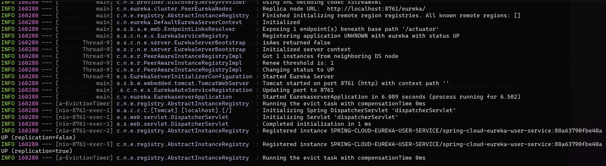
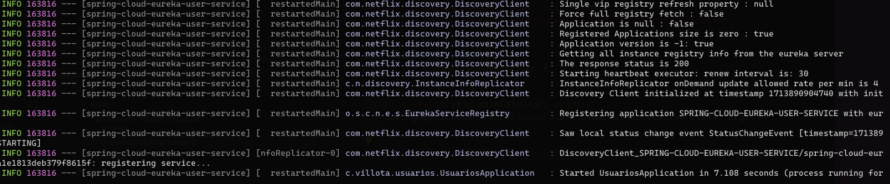

# Eureka Server

## 🧞 Commands

All commands are run from the root of the project, from a terminal:

| Command                   | Action                                           |
| :------------------------ | :----------------------------------------------- |
| `mvn spring-boot:run`             | Run service                            |
| `mvn clean install`             | Build service                            |

## 📚 Decorators
| Annotation     | Description |
| -------------- | ----------- |
| `@Id`          | Specifies the primary key of an entity. |
| `@GeneratedValue` | Provides for the specification of generation strategies for the values of primary keys. |
| `@Column`      | Specifies the mapped column for a persistent property or field. |
| `@PrePersist`  | Callback method annotation. When a new entity is persisted, methods annotated with `@PrePersist` are executed. |
| `@Temporal`    | Converts the date and time values from Java object to compatible database type and vice versa. |
| `@Transactional` | Defines the scope of a single database transaction. |


## 📝 Spring Boot Concepts

| Concept | Explanation |
| :------ | :---------- |
| `ResponseEntity<?>` | Represents the entire HTTP response. You can specify status code, headers, and body. The `<?>` is a wildcard representing any type of body in the response. |
| `Optional` | A container object which may or may not contain a non-null value. It's used to represent nullable return types, so you don't have to check for `null` values. |
| `@PathVariable` | A Spring annotation which indicates that a method parameter should be bound to a URI template variable. If the method parameter is `Map<String, String>`, then all the path variables are added to the map. |


## 📚 Spring Cloud Gateway

| Property | Description |
| --- | --- |
| `spring.cloud.gateway.mvc.routes[0].id=microservico-usuarios` | This line is setting the ID of the first route (index 0) to `microservico-usuarios`. The ID is used to identify the route. |
| `spring.cloud.gateway.mvc.routes[0].uri=lb://microservico-usuarios` | This line is setting the URI of the first route to `lb://microservico-usuarios`. The `lb://` prefix indicates that this route will use a load-balanced WebClient. `microservico-usuarios` is the name of the service this route will forward requests to. |
| `spring.cloud.gateway.mvc.routes[0].predicates=Path=/api/alumnos/**` | This line is setting a predicate for the first route. Predicates determine if a request matches a route. In this case, the route will match any request where the path starts with `/api/alumnos/`. |
| `spring.cloud.gateway.mvc.routes[0].filters=StripPrefix=2` | This line is setting a filter for the first route. Filters can modify requests and responses before they are sent or after they are received. The `StripPrefix=2` filter will remove the first two segments of the path. For example, if the request path is `/api/alumnos/test`, it will be forwarded as `/test`. |

## 💽 Generic Component in Java

A generic component in Java refers to generic classes, interfaces, and methods. Generics allow types (classes and interfaces) to be parameters when defining classes, interfaces, and methods.

The idea is to allow the type (class or interface) to be a parameter to a class or method, and that type is used wherever necessary, thereby providing compile-time type safety.

Here is a simple example of a generic class in Java:

```java
public class Box<T> {
    private T t;

    public void set(T t) {
        this.t = t;
    }

    public T get() {
        return t;
    }
}
```

## 📷 Screenshots

Eureka Server:


Client Service:


## 📦 Requirements

| Requirement | Version |
| :---------- | :------ |
| Java        | 21      |